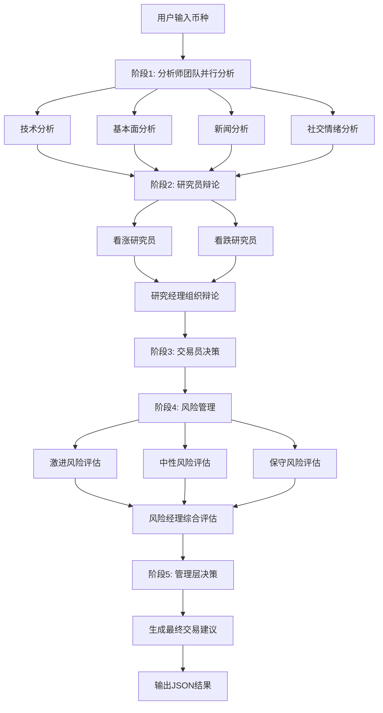

# 🤖 AI加密货币多智能体专家系统

[](https://www.python.org/downloads/)
[](LICENSE)
[](https://openai.com/)
[](https://github.com/ccxt/ccxt)
[](https://github.com/princeniu/Crypto-Agent)

> 🚀 **基于Python的多智能体加密货币交易分析与决策系统**  
> 通过不同角色的AI智能体协作完成多维度、多周期市场分析，并辅助用户进行交易决策

## 📋 目录

- [✨ 功能特性](#-功能特性)
- [🏗️ 系统架构](#️-系统架构)
- [🚀 快速开始](#-快速开始)
- [📊 使用示例](#-使用示例)
- [🔧 配置说明](#-配置说明)
- [🧪 测试指南](#-测试指南)
- [📁 项目结构](#-项目结构)
- [🤝 贡献指南](#-贡献指南)
- [📄 许可证](#-许可证)

## ✨ 功能特性

### 🎯 核心功能
- **🤖 多智能体协作架构** - 5大类智能体团队协作分析
- **📊 多维度市场分析** - 技术面、基本面、新闻、社交情绪
- **💬 智能辩论系统** - 看涨与看跌研究员结构化辩论
- **⚖️ 风险管理机制** - 激进、中性、保守三种风险评估
- **📈 交易决策支持** - 自动生成交易建议和关键点位
- **🔍 独立测试能力** - 每个智能体可单独运行测试

### 🛠️ 技术特性
- **🔄 异步数据处理** - 高效处理多源数据
- **📝 统一状态管理** - AgentState在智能体间传递数据
- **🛡️ 错误处理机制** - 完善的异常处理和容错机制
- **📋 详细日志记录** - 便于调试和监控
- **⚙️ 灵活配置系统** - 支持多种API和数据源

## 🏗️ 系统架构

### 智能体团队结构

```
┌─────────────────────────────────────────────────────────────┐
│                    AI加密货币多智能体专家系统                │
├─────────────────────────────────────────────────────────────┤
│                                                             │
│  📊 分析师团队 (Analysts)                                   │
│  ├─ 技术分析师 (Market Analyst)                            │
│  ├─ 基本面分析师 (Fundamentals Analyst)                    │
│  ├─ 新闻分析师 (News Analyst)                              │
│  └─ 社交媒体分析师 (Social Media Analyst)                  │
│                                                             │
│  🔬 研究员团队 (Researchers)                               │
│  ├─ 看涨研究员 (Bull Researcher)                           │
│  └─ 看跌研究员 (Bear Researcher)                           │
│                                                             │
│  💼 交易执行 (Trader)                                      │
│  └─ 交易员 (Trader)                                        │
│                                                             │
│  ⚖️ 风险管理团队 (Risk Management)                         │
│  ├─ 激进风险评估员 (Aggressive Risk Assessor)             │
│  ├─ 中性风险评估员 (Neutral Risk Assessor)                 │
│  └─ 保守风险评估员 (Conservative Risk Assessor)            │
│                                                             │
│  👨‍💼 管理层 (Managers)                                     │
│  ├─ 研究经理 (Research Manager)                            │
│  └─ 风险经理 (Risk Manager)                                │
│                                                             │
└─────────────────────────────────────────────────────────────┘
```

### 执行流程



## 🚀 快速开始

### 环境要求

- **Python**: 3.11+
- **OpenAI API**: GPT-4o-mini
- **网络连接**: 用于获取市场数据

### 1. 克隆项目

```bash
git clone https://github.com/princeniu/Crypto-Agent.git
cd Crypto-Agent
```

### 2. 安装依赖

```bash
pip install -r requirements.txt
```

### 3. 配置环境变量

```bash
# 复制环境变量模板
cp env_example.txt .env

# 编辑 .env 文件，添加你的API密钥
nano .env
```

**必需配置**:
```bash
OPENAI_API_KEY=your_openai_api_key_here
```

**可选配置**:
```bash
EXCHANGE_NAME=binance
COINGECKO_API_KEY=your_coingecko_api_key
CRYPTOPANIC_API_KEY=your_cryptopanic_api_key
TWITTER_API_KEY=your_twitter_api_key
```

### 4. 运行系统

```bash
# 运行完整分析流程
python main.py

# 或运行系统测试
python test_system.py
```

## 📊 使用示例

### 输入示例

系统接受加密货币交易对作为输入，例如：
- `BTC/USDT` - 比特币/泰达币
- `ETH/USDT` - 以太坊/泰达币
- `BNB/USDT` - 币安币/泰达币

### 输出示例

系统会生成结构化的JSON分析报告：

```json
{
  "symbol": "BTC/USDT",
  "trend": "bullish",
  "entry_price": 61850,
  "stop_loss": 60900,
  "take_profit": 63500,
  "confidence_score": 0.78,
  "risk_level": "medium",
  "position_size": 0.3,
  "analysis_summary": {
    "fundamental": "BTC活跃地址增长，长期利好",
    "technical": "多周期趋势上行，关键支撑61800",
    "news": "美联储加息暂停，市场情绪回暖",
    "social": "Twitter热度上升，Reddit多头情绪强烈"
  },
  "research_consensus": "综合看涨观点...",
  "trading_decision": "建议买入，目标价63500",
  "risk_decision": "中等风险，建议仓位30%",
  "timestamp": "2025-08-06 03:51:26.824897"
}
```

### 独立测试

每个智能体都可以独立运行测试：

```bash
# 测试技术分析师
python agents/analysts/market_analyst.py

# 测试基本面分析师
python agents/analysts/fundamentals_analyst.py

# 测试看涨研究员
python agents/researchers/bull_researcher.py

# 测试交易员
python agents/trader/trader.py

# 测试风险管理
python agents/risk_management/aggressive_risk.py
```

## 🔧 配置说明

### API密钥配置

| 服务 | 必需性 | 用途 | 获取地址 |
|------|--------|------|----------|
| OpenAI API | ✅ 必需 | AI智能体推理 | [OpenAI Platform](https://platform.openai.com/) |
| CoinGecko API | ⚪ 可选 | 基本面数据 | [CoinGecko API](https://www.coingecko.com/en/api) |
| CryptoPanic API | ⚪ 可选 | 新闻数据 | [CryptoPanic API](https://cryptopanic.com/developers/api/) |
| Twitter API | ⚪ 可选 | 社交情绪数据 | [Twitter API](https://developer.twitter.com/) |

### 环境变量说明

```bash
# 必需配置
OPENAI_API_KEY=sk-...                    # OpenAI API密钥

# 可选配置
EXCHANGE_NAME=binance                     # 交易所名称
COINGECKO_API_KEY=CG-...                 # CoinGecko API密钥
CRYPTOPANIC_API_KEY=...                  # CryptoPanic API密钥
TWITTER_API_KEY=...                      # Twitter API密钥
LOG_LEVEL=INFO                           # 日志级别
```

## 🧪 测试指南

### 运行完整测试

```bash
# 运行系统测试
python test_system.py

# 运行模块测试
python test_modules.py
```

### 测试覆盖率

- ✅ 分析师团队测试通过
- ✅ 研究员团队测试通过
- ✅ 交易员测试通过
- ✅ 风险管理测试通过
- ✅ 管理层测试通过
- ✅ 完整流程测试通过

### 性能指标

- **完整分析时间**: 约2-3分钟
- **单个模块时间**: 30秒-1分钟
- **数据准确性**: 基于实时API数据
- **错误处理**: 完善的容错机制

## 📁 项目结构

```
Crypto-Agent/
├── 📄 main.py                    # 主入口：执行完整流程
├── 📄 test_system.py             # 系统测试脚本
├── 📄 requirements.txt           # Python依赖清单
├── 📄 env_example.txt           # 环境变量示例
├── 📄 README.md                 # 项目说明文档
│
├── 🤖 agents/                   # 智能体模块
│   ├── 📊 analysts/             # 分析师团队
│   │   ├── 📄 base.py           # 分析师基础类
│   │   ├── 📄 market_analyst.py # 技术分析师
│   │   ├── 📄 fundamentals_analyst.py # 基本面分析师
│   │   ├── 📄 news_analyst.py   # 新闻分析师
│   │   └── 📄 social_media_analyst.py # 社交媒体分析师
│   │
│   ├── 🔬 researchers/          # 研究员团队
│   │   ├── 📄 base.py           # 研究员基础类
│   │   ├── 📄 bull_researcher.py # 看涨研究员
│   │   └── 📄 bear_researcher.py # 看跌研究员
│   │
│   ├── 💼 trader/               # 交易执行
│   │   ├── 📄 base.py           # 交易员基础类
│   │   └── 📄 trader.py         # 交易员
│   │
│   ├── ⚖️ risk_management/      # 风险管理团队
│   │   ├── 📄 base.py           # 风险管理基础类
│   │   ├── 📄 aggressive_risk.py # 激进风险评估员
│   │   ├── 📄 neutral_risk.py   # 中性风险评估员
│   │   └── 📄 conservative_risk.py # 保守风险评估员
│   │
│   └── 👨‍💼 managers/            # 管理层
│       ├── 📄 base.py           # 管理基础类
│       ├── 📄 research_manager.py # 研究经理
│       └── 📄 risk_manager.py   # 风险经理
│
├── 📊 data_providers/           # 数据获取模块
│   ├── 📄 market_data.py        # 行情数据 (CCXT)
│   ├── 📄 fundamentals.py       # 基本面&链上数据
│   ├── 📄 news_data.py          # 新闻数据 (CryptoPanic)
│   └── 📄 social_data.py        # 社交舆情数据
│
├── 🛠️ utils/                    # 工具模块
│   ├── 📄 state.py              # AgentState和AgentMessage
│   ├── 📄 config.py             # 配置和API Key
│   └── 📄 logger.py             # 日志工具
│
├── 📁 output/                   # 输出结果
│   └── 📄 results.json          # 最终决策输出
│
└── 📁 logs/                     # 日志文件
```

## 🤝 贡献指南

我们欢迎所有形式的贡献！请查看以下指南：

### 贡献类型

- 🐛 **Bug报告** - 提交Issue描述问题
- ✨ **功能请求** - 提出新功能建议
- 📝 **文档改进** - 完善文档和注释
- 🔧 **代码优化** - 改进代码质量和性能
- 🧪 **测试用例** - 添加更多测试覆盖

### 开发流程

1. **Fork项目**
   ```bash
   git clone https://github.com/princeniu/Crypto-Agent.git
   ```

2. **创建功能分支**
   ```bash
   git checkout -b feature/your-feature-name
   ```

3. **开发新功能**
   - 遵循现有代码风格
   - 添加必要的测试
   - 更新相关文档

4. **提交代码**
   ```bash
   git add .
   git commit -m "feat: add new feature"
   git push origin feature/your-feature-name
   ```

5. **创建Pull Request**
   - 详细描述变更内容
   - 包含测试结果
   - 关联相关Issue

### 代码规范

- **Python**: 遵循PEP 8规范
- **命名**: 使用描述性变量和函数名
- **注释**: 为复杂逻辑添加注释
- **测试**: 新功能必须包含测试用例
- **文档**: 更新相关文档

### 智能体开发指南

#### 添加新智能体

1. **继承基类**
   ```python
   from agents.analysts.base import BaseAnalyst
   
   class YourAnalyst(BaseAnalyst):
       def process(self, state):
           # 实现分析逻辑
           return state
   ```

2. **添加独立测试**
   ```python
   if __name__ == "__main__":
       # 独立测试逻辑
       pass
   ```

3. **集成到主流程**
   ```python
   # 在 main.py 中添加
   from agents.analysts.your_analyst import YourAnalyst
   ```

#### 添加新数据源

1. **创建数据提供类**
   ```python
   class YourDataProvider:
       def get_data(self, symbol):
           # 实现数据获取逻辑
           pass
   ```

2. **在智能体中集成**
   ```python
   # 在对应的分析师中使用
   data = YourDataProvider().get_data(symbol)
   ```

## 📄 许可证

本项目采用 [MIT License](LICENSE) 许可证。

```
MIT License

Copyright (c) 2025 AI加密货币多智能体专家系统

Permission is hereby granted, free of charge, to any person obtaining a copy
of this software and associated documentation files (the "Software"), to deal
in the Software without restriction, including without limitation the rights
to use, copy, modify, merge, publish, distribute, sublicense, and/or sell
copies of the Software, and to permit persons to whom the Software is
furnished to do so, subject to the following conditions:

The above copyright notice and this permission notice shall be included in all
copies or substantial portions of the Software.

THE SOFTWARE IS PROVIDED "AS IS", WITHOUT WARRANTY OF ANY KIND, EXPRESS OR
IMPLIED, INCLUDING BUT NOT LIMITED TO THE WARRANTIES OF MERCHANTABILITY,
FITNESS FOR A PARTICULAR PURPOSE AND NONINFRINGEMENT. IN NO EVENT SHALL THE
AUTHORS OR COPYRIGHT HOLDERS BE LIABLE FOR ANY CLAIM, DAMAGES OR OTHER
LIABILITY, WHETHER IN AN ACTION OF CONTRACT, TORT OR OTHERWISE, ARISING FROM,
OUT OF OR IN CONNECTION WITH THE SOFTWARE OR THE USE OR OTHER DEALINGS IN THE
SOFTWARE.
```

## ⚠️ 免责声明

- **投资风险**: 加密货币投资存在高风险，本系统仅供参考
- **数据准确性**: 系统基于公开数据，不保证100%准确性
- **API限制**: 免费API有速率限制，建议合理使用
- **监管合规**: 请遵守当地法律法规

## 📞 联系方式

- **GitHub Issues**: [提交问题](https://github.com/princeniu/Crypto-Agent/issues)
- **项目主页**: [GitHub Repository](https://github.com/princeniu/Crypto-Agent)

---

<div align="center">

**⭐ 如果这个项目对你有帮助，请给我们一个星标！**

Made with ❤️ by the AI Crypto MultiAgent Team

</div> 